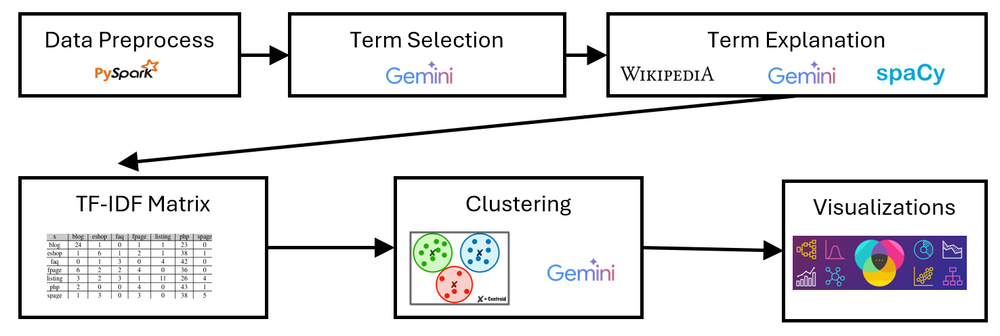
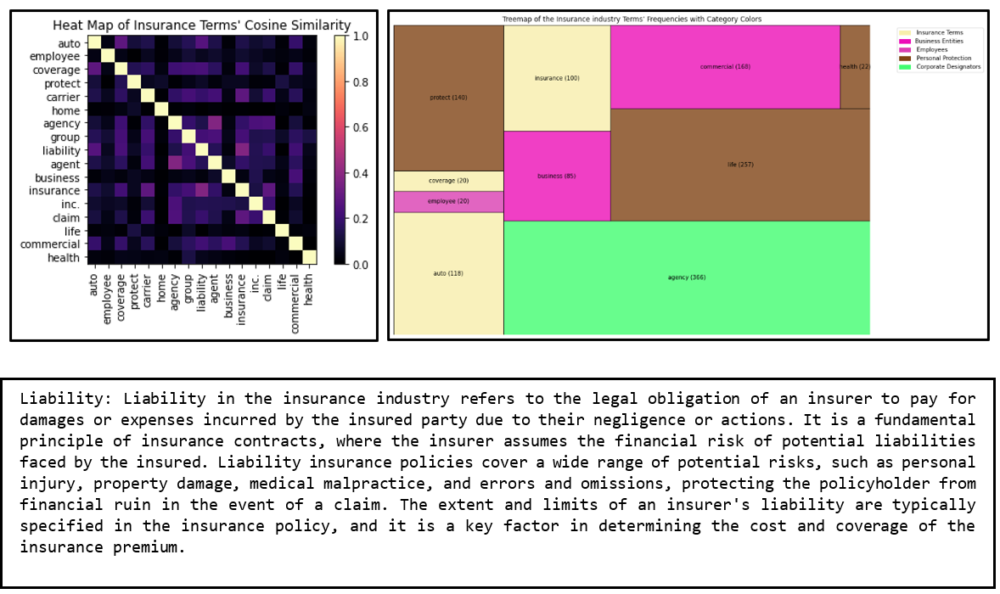

<h3 align='center' style="text-align:center; font-weight:bold; font-size:2.5em">Data Collection and Management Lab (094290) Final Project</h3>
<h1 align='center' style="text-align:center; font-weight:bold; font-size:2.5em">Utilizing LinkedIn Data for Industry Key Terms Analysis and Explanation</h1>

<p align='center' style="text-align:center;font-size:1em;">
    <a>Tomer Eichler</a>&nbsp;,&nbsp;
    <a>Idan Salutsky</a>&nbsp;,&nbsp;
    <a>Nimrod Solomon</a>&nbsp;
</p>


# Motivation

The world is experiencing rapid and significant transformations due to technological advancements, innovations, and disruptions across various domains. These changes present both opportunities and challenges for power users, including investors, CEOs, and entrepreneurs trying to identify and capitalize on promising ventures in markets and industries. Staying informed about these developments can be complex, especially for those seeking a deep understanding of market dynamics and trends. 

To address this, we propose an AI-driven power-users-focused tool that detects the top discussed professional terms at the user's industry of interest, creating a prototype of a report that explains those terms and analyzing the relations between them, using data from companies and personal profiles on LinkedIn, as well as Wikipedia API and Gemini LLM API.

Our solution aims to empower power users by offering an up-to-date report presenting the most discussed topics at their industries of interest, by detecting keywords and buzzwords, presenting them through user-friendly visualizations, graphs, and explaining them using Wikipedia values. 

We also use natural language processing, machine learning and information retrieval techniques to analyze the data and provide relevant insights for each industry.


# Method

**Data Preprocessing:** The system processes LinkedIn data for various industries. It analyzes terms used by companies and employees in different sections: “about,” “specialties,” and posts.

**Term Selection:** The user selects an industry from the available 147 options. The system filters relevant terms using Gemini LLM.

**Wikipedia Explanations:** We use Wikipedia API to find and present a Wikipedia summary for every term. If an exact Wikipedia entry doesn’t exist, we use Word2Vec vectors and cosine similarities for finding a term, suggested by the Wikipedia API, that is the most similar to the term of interest and return its Wikipedia Summary. In the worst case when there are no matches at all, we use Gemini-generated explanations.

**TF-IDF Matrix Calculation:** The system constructs a TF-IDF matrix using the generated explanations as a corpus. It calculates the similarity between terms using cosine similarity.

**Clustering:** K-Means clustering algorithm is applied to group the terms. Cosine similarities serve as distances between terms. Gemini provides cluster names.




# Results

Our findings are geared toward empowering power users with a deeper understanding of these terms. Our solution supplies the user with: 

**Detailed Explanations:** We provide comprehensive explanations for each term.

**Similarities Between Terms:** This insight helps users connect the dots and recognize underlying patterns.

**Clustering and Word Count:** Groups of related terms while shedding light on their significance.

**Top Specialties of Companies:** We've spotlighted the key specialties of companies within the industry. This information guides users in understanding industry dynamics.

**Decomposition of Meta Industry:** Beyond the individual industry of interest, we've zoomed out to explore the meta industry. Our breakdown reveals the sub-industries, providing a holistic view of the ecosystem.



# Running the Project

1. Download the project notebook and upload it to an IDE where the LinkedIn data is available (e.g the course's Databricks IDE).
2. Create a Google AI Studio API key ([Instructions](https://aistudio.google.com/app/apikey)).
3. In the project notebook, in the first code block, locate these lines:

```bash
# Data enrichment libraries imports - Wikipedia module and Gemini LLM
import wikipedia
import google.generativeai as genai
genai.configure(api_key=YOUR_API_KEY)
model = genai.GenerativeModel('gemini-pro')
```

and replace `YOUR_API_KEY` with your API key you have created in stage 2, in string format. 
For example if your API key is `a1b2c3d4`, modify the code as following:

```bash
# Data enrichment libraries imports - Wikipedia module and Gemini LLM
import wikipedia
import google.generativeai as genai
genai.configure(api_key="a1b2c3d4")
model = genai.GenerativeModel('gemini-pro')
```
4. Choose an industry from the following table (Industry column)

```bash
                                                  Industry                 Meta-Industry
0             Furniture and Home Furnishings Manufacturing                 Manufacturing
1                                       Investment Banking      Financial and Investment
2                                Architecture and Planning                      Services
3                                                Wholesale                      Services
4                                      Travel Arrangements                      Services
5                                                 Ranching                 Miscellaneous
6                                Hospitals and Health Care        Healthcare and Medical
7                           Book and Periodical Publishing                      Services
8                                        Printing Services                      Services
9                       Professional Training and Coaching                      Services
10                 Computers and Electronics Manufacturing                 Manufacturing
11                                            Shipbuilding                 Manufacturing
12                                   Public Policy Offices  Government and Public Policy
13                                    Software Development                    Technology
14                   Outsourcing and Offshoring Consulting                      Services
15                                        Retail Groceries     Retail and Consumer Goods
16                       Education Administration Programs        Education and Training
17                                  Plastics Manufacturing                 Manufacturing
18            Renewable Energy Semiconductor Manufacturing                 Manufacturing
19                            Computer Networking Products                    Technology
20                                         Events Services                      Services
21                                    Information Services                      Services
22                              Food and Beverage Services                      Services
23                             Semiconductor Manufacturing                 Manufacturing
24                        Business Consulting and Services                      Services
25                                               Insurance                      Services
26                                      Financial Services                      Services
27                                       Wireless Services                      Services
28                         Computer Hardware Manufacturing                    Technology
29                                           Public Safety                      Services
30                                 Maritime Transportation  Transportation and Logistics
31                                   Tobacco Manufacturing                 Manufacturing
32                                     Writing and Editing                      Services
33                                     Veterinary Services                      Services
34                                 Staffing and Recruiting                      Services
35                                              Accounting                      Services
36                                   International Affairs  Government and Public Policy
37                                        Spectator Sports                 Miscellaneous
38              Glass, Ceramics and Concrete Manufacturing                 Manufacturing
39                                  Chemical Manufacturing                 Manufacturing
40                                                  Mining                 Miscellaneous
41                                    E-Learning Providers                    Technology
42                             Security and Investigations                      Services
43                            Translation and Localization                      Services
44                      Automation Machinery Manufacturing                    Technology
45                           Computer and Network Security                    Technology
46                                 Political Organizations  Government and Public Policy
47                                  Environmental Services  Government and Public Policy
48                                             Oil and Gas                 Miscellaneous
49                                             Real Estate  Real Estate and Construction
50                                             Think Tanks  Government and Public Policy
51                                       Executive Offices                 Miscellaneous
52                                            Law Practice                      Services
53                                 Nanotechnology Research                 Miscellaneous
54                     International Trade and Development  Government and Public Policy
55                     Personal Care Product Manufacturing                 Manufacturing
56                      Philanthropic Fundraising Services                      Services
57                                 Entertainment Providers       Media and Entertainment
58                                         Market Research       Media and Entertainment
59                               Movies, Videos, and Sound       Media and Entertainment
60                            Sporting Goods Manufacturing                 Manufacturing
61                                          Graphic Design                      Services
62                    Technology, Information and Internet                    Technology
63                           IT Services and IT Consulting                    Technology
64                                 Retail Office Equipment     Retail and Consumer Goods
65                             Wholesale Import and Export                      Services
66                                         Capital Markets      Financial and Investment
67                                         Law Enforcement                      Services
68                      Freight and Package Transportation  Transportation and Logistics
69                      Industrial Machinery Manufacturing                 Manufacturing
70                                Non-profit Organizations                 Miscellaneous
71                                     Retail Art Supplies     Retail and Consumer Goods
72                           Animation and Post-production       Media and Entertainment
73     Transportation, Logistics, Supply Chain and Storage  Transportation and Logistics
74          Aviation and Aerospace Component Manufacturing  Transportation and Logistics
75                                             Fundraising      Financial and Investment
76                        Railroad Equipment Manufacturing  Transportation and Logistics
77                                            Construction  Real Estate and Construction
78                                   Investment Management      Financial and Investment
79                                               Utilities                 Miscellaneous
80                         Retail Luxury Goods and Jewelry     Retail and Consumer Goods
81                                 Warehousing and Storage  Transportation and Logistics
82                                        Media Production       Media and Entertainment
83                         Gambling Facilities and Casinos       Media and Entertainment
84                         Defense and Space Manufacturing                 Manufacturing
85                                     Facilities Services                      Services
86                           Government Relations Services  Government and Public Policy
87                                    Advertising Services       Media and Entertainment
88                  Paper and Forest Product Manufacturing                 Manufacturing
89                  Packaging and Containers Manufacturing                 Manufacturing
90                                      Telecommunications                    Technology
91                         Medical Equipment Manufacturing        Healthcare and Medical
92                                  Beverage Manufacturing                 Manufacturing
93                                             Restaurants     Retail and Consumer Goods
94                     Leasing Non-residential Real Estate  Real Estate and Construction
95                                    Newspaper Publishing       Media and Entertainment
96                                            Armed Forces                 Miscellaneous
97   Appliances, Electrical, and Electronics Manufacturing                 Manufacturing
98                                             Hospitality                      Services
99                            Pharmaceutical Manufacturing        Healthcare and Medical
100                                      Research Services                      Services
101                             Retail Apparel and Fashion     Retail and Consumer Goods
102                                            Photography       Media and Entertainment
103                          Wellness and Fitness Services                      Services
104                                   Truck Transportation  Transportation and Logistics
105                                      Consumer Services                      Services
106                           Wholesale Building Materials                      Services
107                               Human Resources Services                      Services
108                                  Airlines and Aviation  Transportation and Logistics
109                                Machinery Manufacturing                 Manufacturing
110                         Individual and Family Services                      Services
111                            Motor Vehicle Manufacturing                 Manufacturing
112                                        Performing Arts       Media and Entertainment
113                    Museums, Historical Sites, and Zoos       Media and Entertainment
114            Broadcast Media Production and Distribution       Media and Entertainment
115                                                Banking      Financial and Investment
116                                Recreational Facilities                 Miscellaneous
117                              Government Administration  Government and Public Policy
118           Public Relations and Communications Services       Media and Entertainment
119                                              Fisheries                 Miscellaneous
120                                      Medical Practices        Healthcare and Medical
121                                 Religious Institutions                 Miscellaneous
122                           Online Audio and Video Media       Media and Entertainment
123                                    Artists and Writers                 Miscellaneous
124                                 Biotechnology Research        Healthcare and Medical
125                                         Legal Services                      Services
126                                                 Retail     Retail and Consumer Goods
127                                      Civil Engineering                      Services
128                                              Libraries                 Miscellaneous
129                         Alternative Dispute Resolution                 Miscellaneous
130                                          Manufacturing                 Miscellaneous
131                                        Design Services                      Services
132                            Dairy Product Manufacturing                 Manufacturing
133                                       Higher Education        Education and Training
134                         Civic and Social Organizations                 Miscellaneous
135                                  Textile Manufacturing                 Manufacturing
136          Venture Capital and Private Equity Principals      Financial and Investment
137                                     Mental Health Care        Healthcare and Medical
138                                              Musicians       Media and Entertainment
139                                                Farming                 Miscellaneous
140                                         Computer Games       Media and Entertainment
141                          Strategic Management Services                      Services
142                        Food and Beverage Manufacturing                 Manufacturing
143                        Primary and Secondary Education        Education and Training
144                                   Alternative Medicine        Healthcare and Medical
145                                    Legislative Offices                      Services
146                              Administration of Justice                      Services
147                                     Mobile Gaming Apps       Media and Entertainment
```

5. Locate the following code block in the notebook and replace the `industry_name` variable with the industry that you have selected in stage 4, in string format. For example, if you chose the `Insurance` industry, modify the block as following:

```bash
################################## USER INPUT ###################################
# USER - SELECT ONE OF THE ABOVE INDUSTRIES (INDUSTRY COLUMN) AND CHANGE THIS ROW
industry_name = "Insurance"  
############################### END OF USER INPUT ###############################
```

6. Run the full notebook to review results

**Note**: It is possible that when you run the notebook, a Gemini API runtime error will be returned to you with a message saying that it took too long to receive a response from the API and therefore the process terminated. This happens when many requests are made from the API and in a frequent manner. In this case the problematic block must be run again and again until a response is received from the API and then the rest of the blocks should be run as usual.

